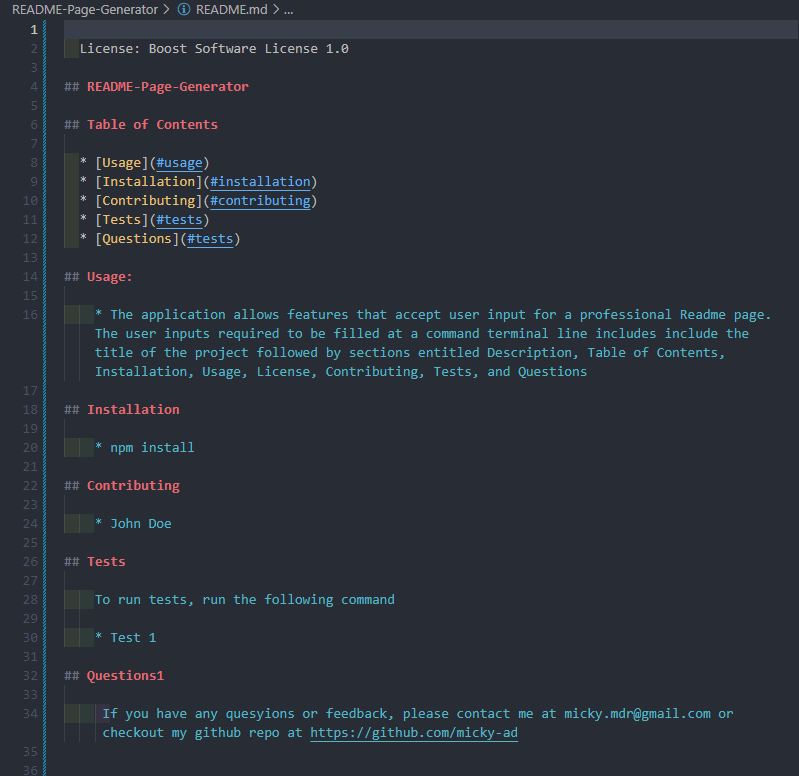
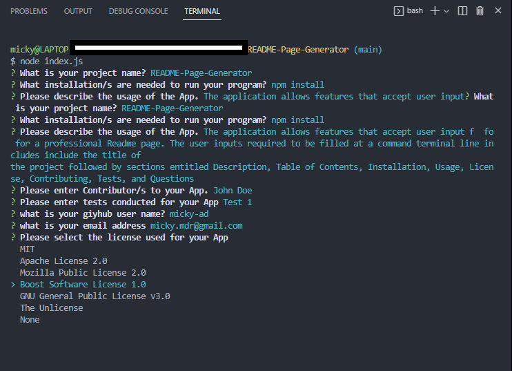

# README-Page-Generator

A professional README page Generator 

# Links
-----------------------------------------------------------------------
### [Demonstration Video](https://youtu.be/CJtoYFrJzzY)
### [Repository](https://github.com/Micky-Ad/README-Page-Generator)

# Screenshot:
----------------------------------------------------------------------

 
 

# Usage:
----------------------------------------------------------------------
 - The application allows features that accept user input for a professional Readme page. The user inputs required to be filled at a  terminal include the title of the project followed by sections entitled Description, Table of Contents, Installation, Usage, License, Contributing, Tests, and Questions
 - The user inputs for the sections are added with format the title of the README, description, installation instructions, usage information, contribution guidelines, test instructions, and license for the application from a list of options.
 - The user will then be prompted to add his/her GitHub username with a link to  GitHub profile and email address.
 - The Table of Contents will have links to the corresponding section of the README page.

# Built with
-----------------------------------------------------------------------
 - node.js
 - nmp
 
